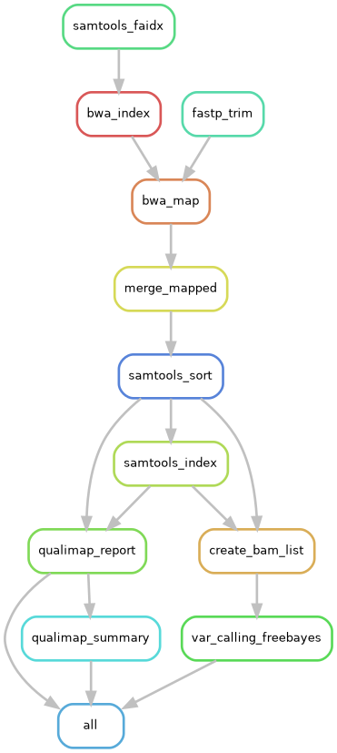

# Population Mapping and Variant Calling Pipeline

This repository provides a **Snakemake-based pipeline** for integrated population mapping and variant calling.  
The workflow is designed for **multi-sample whole-genome sequencing (WGS)** data and automates the process from raw FASTQ files to a filtered population-level VCF.

The pipeline supports both **local execution** and **HPC environments (SLURM)** and uses a **parallelized FreeBayes strategy** for scalable variant calling.

**Author:** Rizal  
**Based on:** Carolina Pita Barros framework and WUR pipelines  
**Execution mode:** Local and HPC (SLURM)  
**Year:** 2025


## Table of Contents

1. Introduction  
2. Workflow Overview  
3. Setup and Configuration  
4. Execution  
5. Output Structure  

## Introduction

This pipeline automates the transition from raw sequencing reads to a filtered population-level VCF file.  
It is optimized for **multi-sample datasets** and includes automated directory initialization, logging, and quality control at both read and alignment levels.

The workflow emphasizes **reproducibility**, **modularity**, and **scalability** for population-scale variant discovery.

## Workflow Overview

The pipeline implements the following main steps:

1. **Read Trimming**  
   Adapter removal and quality filtering using `fastp` with a sliding window approach.

2. **Reference Indexing**  
   Automated indexing of the reference genome using `samtools` and `bwa-mem2`.

3. **Read Mapping**  
   Alignment with `bwa-mem2`, streamed through `samblaster` for duplicate marking.

4. **Post-processing**  
   Merging of library lanes, coordinate sorting, and BAM indexing using `samtools`.

5. **Quality Control**  
   Mapping statistics and coverage assessment using `Qualimap BamQC`.

6. **Variant Calling**  
   Parallelized variant calling with `FreeBayes` across genomic regions, followed by filtering with `vcffilter` (QUAL > 20).

## Setup and Configuration

### 1. Prerequisites

Ensure the following tools are available in your environment (recommended via Conda):

- Snakemake  
- bwa-mem2  
- samtools  
- samblaster  
- fastp  
- qualimap  
- freebayes  
- vcflib  
- htslib  
## Workflow overview



### 2. Configuration File

All environment- and dataset-specific settings are defined in `config.yaml`.  
This design decouples file paths and parameters from the workflow logic.

Example configuration:

```yaml
OUTDIR: "results/"
ASSEMBLY: "/path/to/reffrence.fa"
GFF_FILE: "/path/to/reffrence.gff3"
PREFIX: "prefix"
NUM_CHRS: 30
PATHS_WITH_FILES:
  group1: "/path/to/raw_fastq_data1"
  group2: "/path/to/raw_fastq_data2"
```


## Execution

### Dry Run

Always validate the workflow before execution:

```bash
snakemake -np
```
Local Execution
Run the pipeline locally using a defined number of cores:

```bash
snakemake --cores 24
```
SLURM (HPC) Execution
For execution on an HPC cluster with SLURM:
```bash
snakemake --cores 1 \
  --jobs 20 \
  --cluster "sbatch -p {partition} -c {threads} --mem=32G \
  -o logs_slurm/%x_%j.out \
  -e logs_slurm/%x_%j.err"
```
Output Structure
All results are organized within the directory specified by OUTDIR:

trimmed_reads/
Cleaned FASTQ files and fastp HTML/JSON reports.

processed_reads/
Final sorted and indexed BAM files (*.sorted.bam).

mapping_stats/
Qualimap reports and a consolidated sample_quality_summary.tsv.

results/variant_calling/
Final population VCF file ({PREFIX}.vcf.gz) and index.

logs_slurm/
Standard output and error logs from SLURM jobs.
